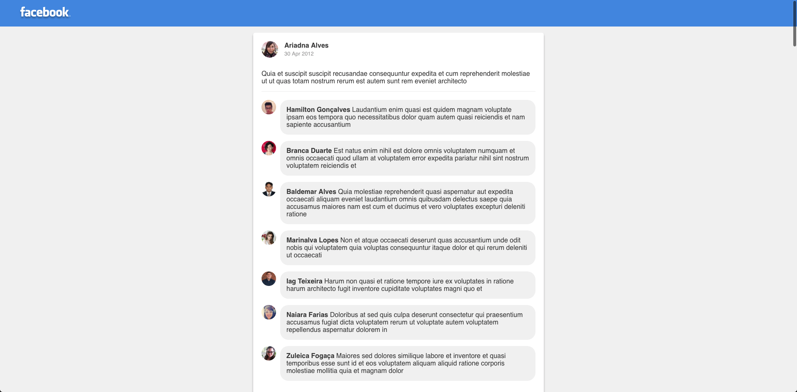

# Facebook clone

Esse projeto é basicamente um clone simplificado do sistema de posts e comentários do Facebook. Desafio realizado utilizando Vue.js 

Todos os posts e comentários são gerados randomicamente utilizando as apis do [Random user](https://randomuser.me/) e do [JSONPlaceholder](https://jsonplaceholder.typicode.com/)

### Rodando o projeto

O projeto está com o webpack e o babel configurado para o Vue, e para rodar o projeto basta instalar as dependências: 
`yarn install` ou `npm install` 

Em seguida rodar o servidor: 

`yarn dev` ou `npm run dev` 

Em seguida basta abrir o navegador com a url: `http://localhost:8080`

### Preview da interface

